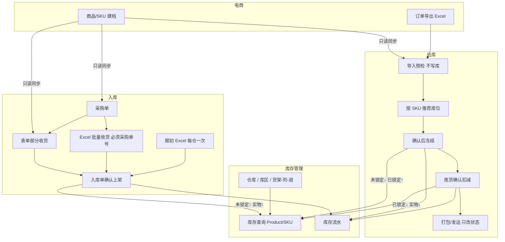
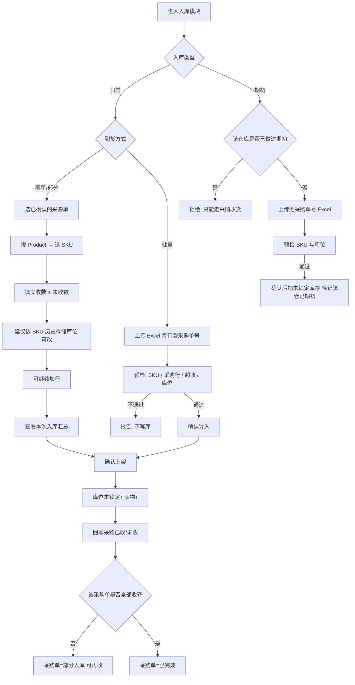
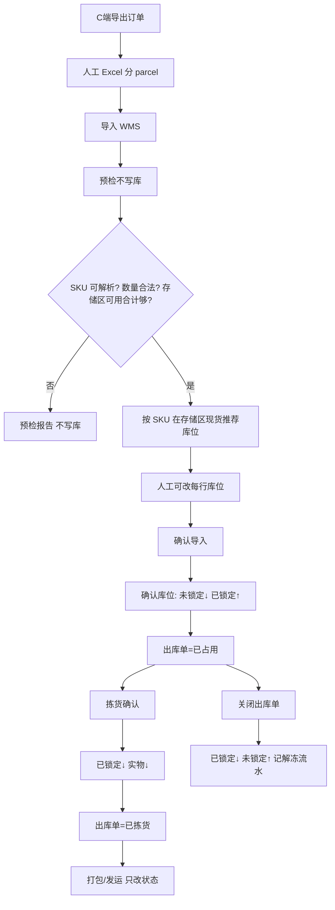
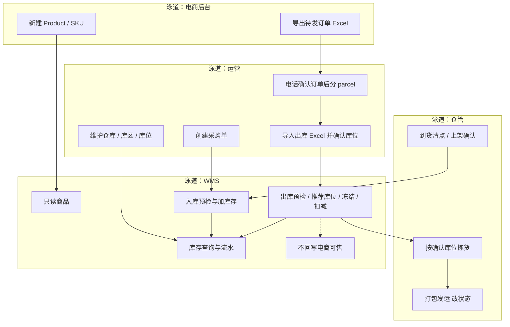
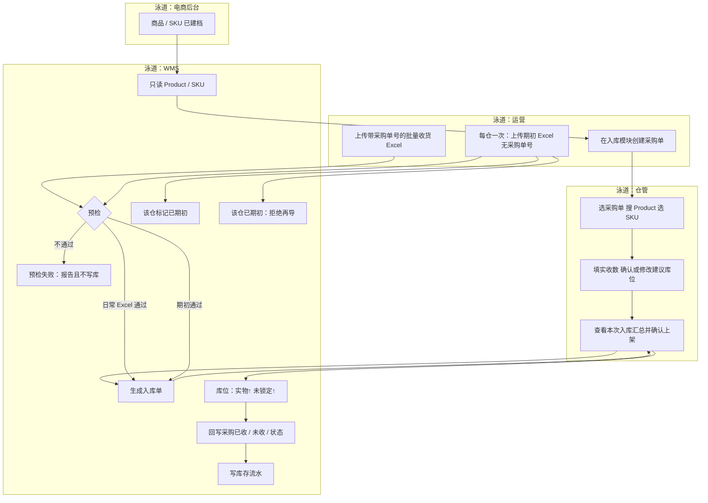
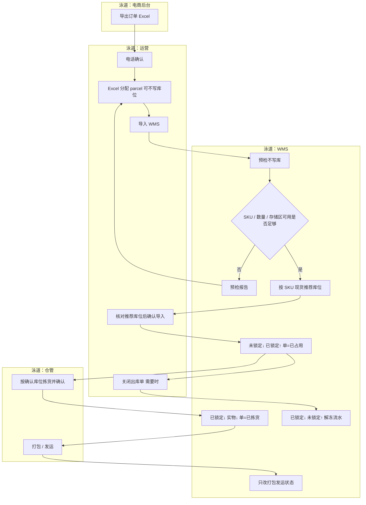

# 微型仓 WMS 设计说明

日期：2026-08-19  
状态：待产品确认后进入实现计划  
范围：跨境零售电商配套的独立微型仓系统（一期）

## 1. 背景与目标

公司需要一套与 C 端电商平台作业解耦的微型仓 WMS，覆盖库存管理、入库、出库。订单需求从 C 端后台导出为 Excel，运营在表内完成 parcel 分配后导入 WMS。WMS 按库位记账，完成冻结、增减与履约状态流转。

一期目标：

- 把实物库存记到「仓库 → 库区 → 货架 → 列 → 层」
- 采购到货可分次收、可批量收，开仓可做一次期初导入
- 出库导入后由系统按 SKU 现货推荐库位，确认后锁定，拣货后扣减
- 提供 Product / SKU 两种库存视角，以及完整库存流水

非目标（一期不做，模型或接口可预留）：

- 盘库作业
- 库存回写电商可售
- 退货作业界面
- 无采购单的日常入库（期初除外）
- 系统自动波次、拣货路径优化
- 报损作业（报损区先建，流程后做）

## 2. 约束与已拍板决策

| 项 | 决策 |
|---|---|
| 系统定位 | 独立微型仓执行系统，不是电商仓配中台 |
| 商品主数据 | 只读电商库；新建商品只在电商后台 |
| 库位精度 | 仓库 → 库区 → 货架 → 列 → 层 |
| 库区 | 收货区、存储区、报损区 |
| 库存口径 | 实物 = 已锁定 + 未锁定（可用） |
| 出库来源 | C 端导出 Excel，人工分 parcel，可不写库位 |
| 出库库位 | 导入预检后按 SKU 现货推荐，人工确认后再冻结 |
| 冻结时点 | 出库预检通过且确认导入后，按确认库位冻结 |
| 扣减时点 | 拣货确认；打包/发运只改单据状态 |
| 上游电话确认 | 导入 WMS 之前的运营动作，仓内不重复锁一次 |
| 入库日常 | 必须有采购单：表单部分收，或 Excel 批量（行上带采购单号） |
| 入库期初 | 每仓仅一次无采购单号批量导入 |
| 采购单位置 | 做在入库模块内，不单独成一级模块 |
| 无单入库 | 一期不做（期初除外） |
| 库存回写电商 | 一期不做，接口预留 |
| 盘库 / 退货 | 一期不做；若以后做，盘库放库存管理模块 |

## 3. 模块结构

一期三个一级模块：

```text
库存管理
├── 仓库管理（创建 / 列表 / 编辑 / 删除；名称、地址）
├── 库区与库位（收货区 / 存储区 / 报损区；货架-列-层）
├── 库存查询（Product 视角 / SKU 视角；锁定 / 未锁定 / 实物）
└── 库存流水（期初、采购入库、占用、扣减、解冻）

入库
├── 采购单
├── 表单部分收货（按采购单）
├── Excel 批量收货（必须采购单号）
└── 期初 Excel（每仓一次，无采购单号）

出库
├── Excel 导入预检（不写库）
├── 按 SKU 推荐库位并确认冻结
├── 拣货确认扣减
└── 打包 / 发运（只改状态）
```

## 4. 核心对象

### 4.1 仓库与库位

- 仓库：名称、地址。有库存或未完成采购/入出库单时不可删除。
- 库区：隶属仓库，类型为收货区 / 存储区 / 报损区。
- 库位：仓库 + 库区 + 货架 + 列 + 层，全局唯一。库存记在库位。

出库推荐只使用 **存储区** 且未锁定数量大于 0 的库位。收货区可用于暂存，一期允许入库记到收货区，但出库不从收货区推荐。报损区一期只建档，不参与推荐、不做出报损作业。

### 4.2 商品副本

- WMS 不维护商品主数据。打开表单搜索、出库/入库预检时只读查询电商库；可将结果缓存在本地副本，电商不可达则预检失败。
- 入库表单与采购单：先搜索 Product，再下拉该 Product 下的 SKU。
- 预检或导入时 SKU 必须能在电商库或本地副本中解析到。

### 4.3 库位库存

每个库位 × SKU 一行账：

- `on_hand`（实物）
- `locked`（已锁定）
- `available`（未锁定）= `on_hand - locked`

查询可按仓库、库区或 SKU / Product 汇总。示例：

```text
SKU: 20000MA Large Capacity Mini Comes with Four wire Power Bank-黑色
实物总库存 100
已锁定（订单占用） 2
未锁定（可用） 98
```

### 4.4 采购单（入库模块内）

- 头：单号、供应商（可先选填）、仓库、状态、创建人、时间。
- 行：Product、SKU、采购数、已收数、未收数。
- 状态：草稿 → 已确认 → 部分入库 → 已完成 / 已关闭。
- 建单同样：搜 Product → 选 SKU。采购行不写库位。

### 4.5 入库单

- 头：单号、仓库、类型（采购收货 / 期初）、来源（表单 / Excel）、关联采购单（期初为空）、状态、操作人、时间。
- 行：Product、SKU、实收数、建议库位、实际库位。
- 一张入库单一头多行，查看页展示本次汇总。
- 确认上架后：对应库位 `on_hand`↑、`available`↑；采购收货则回写采购已收/未收。

同一采购单可对应多张入库单（分次收）。单行实收数不得超过该采购行未收数。

### 4.6 出库单

- 头：单号、来源文件、状态、操作人、时间。
- 行：parcel 标识、SKU、数量、建议库位、确认库位。
- 状态：预检中 → 待确认库位 → 已占用 → 已拣货 → 已打包 / 已发运；可关闭（解冻）。

### 4.7 库存流水

每笔变更记录：时间、仓库、库位、SKU、数量、变更后实物/锁定/可用、类型、关联单号、操作人。

一期类型：期初入库、采购入库、出库占用、出库扣减、取消解冻。

## 5. 主流程

### 5.1 总览



### 5.2 入库



入库库位建议规则：取该 SKU 在本仓库存储区最近一次成功上架的库位；无历史则不预填，必须人工选或由 Excel 给出。用户可将实际上架库位改到收货区或存储区；出库推荐仍只看存储区。

期初 Excel 行至少包含：SKU、数量、仓库、库区、货架、列、层。该仓库一旦存在类型=期初且已确认的入库单，禁止再次期初导入。

日常批量 Excel 行至少包含：采购单号、SKU、实收数；库位列可选，缺省则用历史建议，预检阶段必须补全才能确认。

### 5.3 出库



出库推荐规则（一期，够用即可）：

1. 只考虑该 SKU 在目标仓库存储区、`available > 0` 的库位。
2. 按可用数量从大到小，必要时拆到多个库位（一行拆多行或一行带多个库位，实现时选「一行一个库位、数量拆行」更简单）。
3. 可用合计不足则预检失败，整单不进入确认冻结。
4. 报损区、收货区不参与推荐。

出库预检与冻结是两步：先出报告（零库存写入），用户改库位或改 Excel 后可再次预检；只有「确认导入」才冻结。

拣货确认按行：该行确认库位上 `locked` 与 `on_hand` 同减。打包、发运不回改库存。

### 5.4 全链路泳道图

泳道：电商后台、运营、仓管、WMS。库存账记在 WMS 内，不回写电商。

#### 5.4.1 总览泳道



#### 5.4.2 入库泳道（采购收货 + 期初）



说明：日常两条入库入口都在入库模块——表单部分收（仓管）、Excel 批量（运营上传、仓管或运营确认上架）。期初仅运营上传，WMS 校验「每仓一次」。

#### 5.4.3 出库泳道



#### 5.4.4 泳道职责对照

| 泳道 | 负责 | 不负责 |
|---|---|---|
| 电商后台 | 建商品、导出订单 | 不记库位库存、不接收 WMS 回写 |
| 运营 | 采购单、parcel Excel、导入确认、关单解冻、期初导入 | 不代替仓管拣货 |
| 仓管 | 部分收货表单、上架确认、拣货、打包发运 | 不改电商订单、不盘库（一期） |
| WMS | 预检、推荐库位、冻结/扣减/解冻、流水、库存查询 | 不回写电商可售、不自动找货路径 |

## 6. 库存查询

- SKU 视角：一行一个 SKU，可下钻仓库 / 库区 / 货架-列-层，展示实物、锁定、未锁定。
- Product 视角：按 Product 汇总其下 SKU，再下钻。
- 筛选：仓库、库区、SKU 编码/名称、仅显示有货。

## 7. 异常与校验

| 场景 | 处理 |
|---|---|
| 出库预检失败 | 整份文件不冻结，返回行级原因 |
| 出库确认时可用已被其他单占用 | 拒绝冻结，提示重新预检 |
| 入库表单超未收数 | 行级拦截 |
| 批量入库缺采购单号或采购行不匹配 | 预检失败，不写库 |
| 批量入库超未收 | 预检失败 |
| 仓库已做过期初再导期初 | 拒绝 |
| 删除仓库 | 有库存或未完成单据则拒绝 |
| 关闭已占用出库单 | 按行解冻，写解冻流水 |
| 商品在电商侧下架 | WMS 副本保留，已有单据可完成；新入库/出库预检可告警但不在一期做复杂策略 |

一期不做部分成功导入（出库、日常入库 Excel 均为预检全过才允许确认）。

## 8. 预留扩展

不实现，但对象上留口，避免一期把类型写死到无法加：

- 入库单类型可扩展：退货入库、无单入库
- 流水类型可扩展：盘盈、盘亏、报损、移库
- 库存同步：预留「可售数量推送电商」的接口位置，一期不调用
- 盘库：以后放在库存管理模块

## 9. 一期验收标准

- 能建仓库、三类库区、库位到列层；库存查询两种视角数字正确。
- 能建采购单；表单可对同一采购单分次收货；已收/未收/状态正确。
- 带采购单号的 Excel 可批量收货；缺号或超收被预检拦住。
- 每仓只能成功确认一次期初导入。
- 出库 Excel 可不含库位；预检通过后给出存储区建议；确认后锁定，拣货后扣减，取消后解冻。
- 打包/发运不改变库存数字。
- 流水能追溯到单号与库位。
- WMS 不写回电商库存；不出现盘库、退货作业入口。

## 10. 实现边界（对本仓库）

本说明是产品设计，不是当前 `triplay-web` 前端的实现任务。若后续单独开 WMS 工程，以本文为规格；未批准前不写业务代码。
